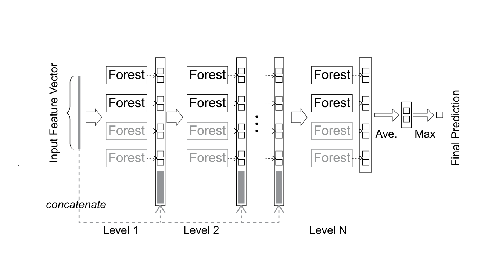

# casForest
Script for classification with cascade Deep Forest ([Zhou & Feng, 2019](https://doi.org/10.1093/nsr/nwy108)). The Iris dataset ([Anderson, 1935](https://wiki.irises.org/pub/Hist/Info1986SIGNA37/SIGNA_37.pdf); [Anderson, 1936](https://doi.org/10.2307/2394164); [Fisher, 1936](https://doi.org/10.1111/j.1469-1809.1936.tb02137.x)) is used for demonstration. The implementation is compatible with MATLAB R2019b.

Usage:

```matlab
call_generic_casForest()
```

<p align="center">
    
</p>

Cite As

[Nzakimuena, C. B. (2020). Automated analysis of retinal and choroidal OCT and OCTA images in AMD. Ecole Polytechnique, Montreal (Canada).](https://publications.polymtl.ca/5234/)

### References

1. [Zhou, Z. H., & Feng, J. (2019). Deep forest. National science review, 6(1), 74-86.](https://doi.org/10.1093/nsr/nwy108)
1. [Anderson, E. (1935). The irises of the Gaspe Peninsula. Bulletin of American Iris Society, 59, 2-5.](https://wiki.irises.org/pub/Hist/Info1986SIGNA37/SIGNA_37.pdf)
1. [Anderson, E. (1936). The species problem in Iris. Annals of the Missouri Botanical Garden, 23(3), 457-509.](https://doi.org/10.2307/2394164)
1. [Fisher, R. A. (1936). The use of multiple measurements in taxonomic problems. Annals of eugenics, 7(2), 179-188.](https://doi.org/10.1111/j.1469-1809.1936.tb02137.x)
