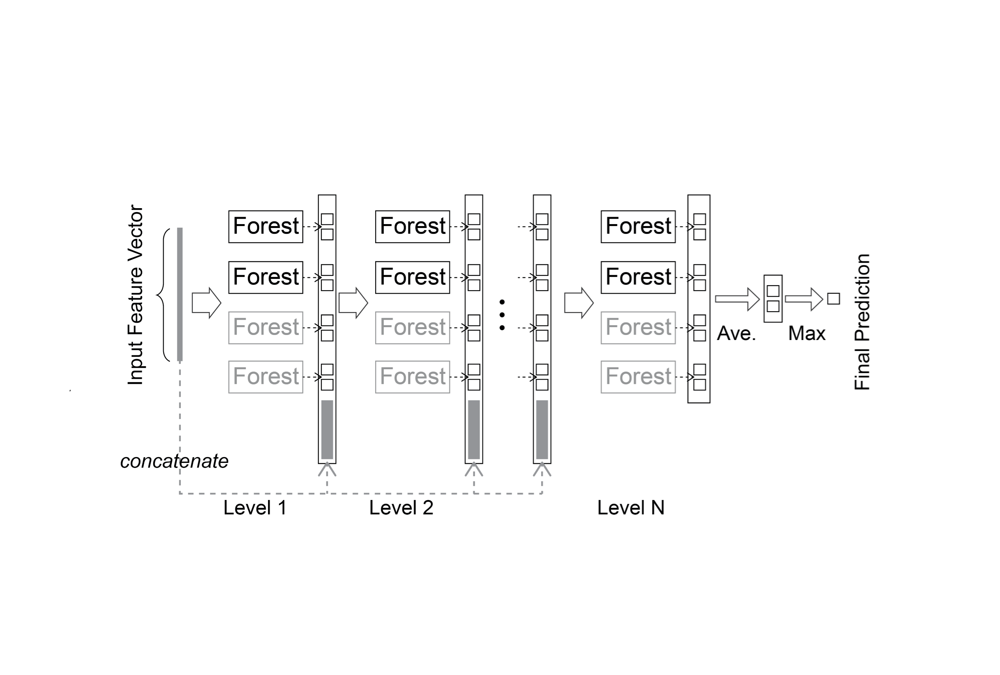

# casForest
The casForest package is a MATLAB implementation of the cascade Deep Forest.

The Deep Forest model is described in:

Z.-H. Zhou and J. Feng, "Deep forest," arXiv preprint arXiv:1702.08835, 2017.

usage:

```matlab
call_generic_casForest()
```

Cite As

C. B. Nzakimuena, "Automated analysis of retinal and choroidal OCT and OCTA images in AMD," Polytechnique Montréal, 2020


